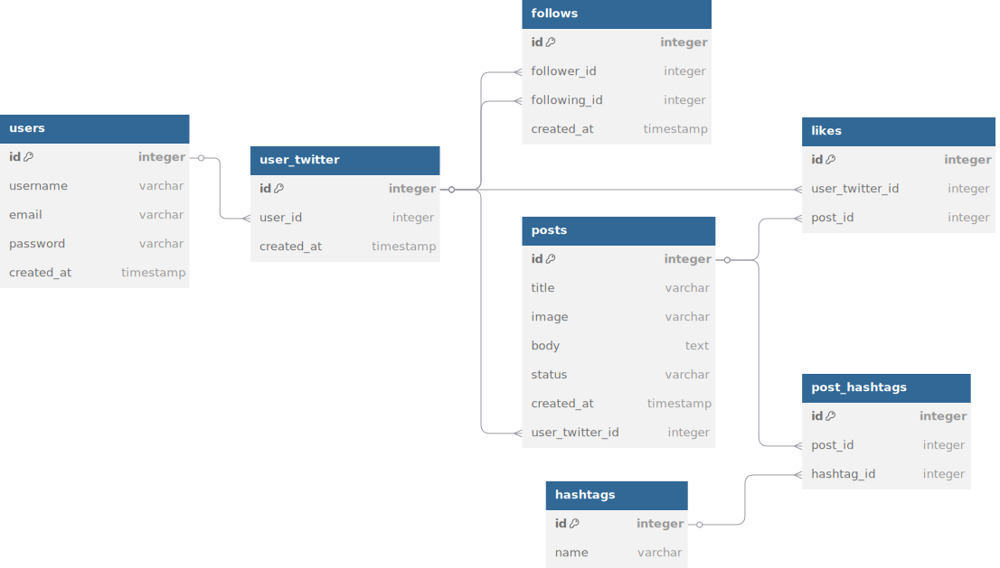

# 📱 Mini-Twitter API

A practical project developed as part of the **B2Bit Trainee selection process**, where a **RESTful API** was built to replicate basic functionalities of a social media platform similar to **Twitter**.

---

## 🚀 Project Overview

The objective of this project is to implement a scalable and well-structured REST API for a simplified version of Twitter, supporting user registration, authentication, posting, following/unfollowing users, and a personalized feed.

---

## ✅ Requirements

### \[TC.1] API Development

* Language: **Python 3**
* Framework: **Django REST Framework**
* Design: Follows RESTful design principles

### \[TC.2] 🔐 Authentication

* Uses **JWT (JSON Web Tokens)** for authentication and session control

### \[TC.3.1] 💽 Database

* **PostgreSQL** as the relational database
* Follows normalization and performance best practices

### \[TC.4] 📄 Pagination

* Implements **pagination** for the feed endpoint

### \[TC.6] 📝 Documentation:

* Implements API documentation using Swagger.

### \[TC.7] 🐳 Docker:

* The project should be containerized using **Docker**. Provide a `Dockerfile` and `docker-compose.yml` for easy setup.

### \[TC.8] 📂 Git

* The project is available on a **public Git repository**

---

## 🐳 Running with Docker

> ⚠️ could not get around the synchronization issue between Django and database startup, so for docker to work the services must be started **in order**:

1. **Build the containers**:

```bash
docker compose build
```

2. **Start the database service**:

```bash
docker compose up database -d
```

3. **Start the application**:

```bash
docker compose up app -d
```

## 🔐 Exemplo de `.env`

Crie um arquivo `.env` na raiz do projeto com as seguintes variáveis:

```env
DEBUG=True
SECRET_KEY=uma-chave-secreta-bem-forte
ALLOWED_HOSTS=localhost,127.0.0.1

POSTGRES_DB=mini_twitter
POSTGRES_USER=postgres
POSTGRES_PASSWORD=postgres
POSTGRES_HOST=database
POSTGRES_PORT=5432

DJANGO_SUPERUSER_USERNAME=admin
DJANGO_SUPERUSER_EMAIL=admin@example.com
DJANGO_SUPERUSER_PASSWORD=admin123
```

---

## 📚 Use Cases

### 👤 CASE 1: User Registration & Login

* Users can register using `username`, `email`, and `password`
* JWT is used to manage authentication and sessions

### 📝 CASE 2: Create Post

* Authenticated users can create text posts with an optional image
* Posts can receive **likes** from other users

### 🤝 CASE 3: Follow / Unfollow

* Users can follow or unfollow others
* Feed displays only posts from **followed users**

### 📰 CASE 4: View Feed

* Authenticated users can view a **paginated** feed
* Posts are **ordered by most recent creation time**

---

## 🗃️ Database Modeling

<p align="center">
  
</p>

---

## 📡 Implemented Endpoints

Below is a list of the available API endpoints exposed by this application:

### 🔐 Authentication

| Method | Endpoint              | Description       |
| ------ | --------------------- | ----------------- |
| POST   | `/api/token/`         | Obtain JWT token  |
| POST   | `/api/token/refresh/` | Refresh JWT token |

### 👤 User Management

| Method | Endpoint                   | Description            |
| ------ | -------------------------- | ---------------------- |
| GET    | `/api/users/registration/` | List registered users  |
| POST   | `/api/users/registration/` | Register new user      |
| POST   | `/api/users/follow/{id}/`  | Follow/unfollow a user |

### 📝 Posts

| Method | Endpoint                | Description             |
| ------ | ----------------------- | ----------------------- |
| GET    | `/api/posts/`           | List all posts          |
| POST   | `/api/posts/`           | Create a new post       |
| GET    | `/api/posts/{id}/`      | Retrieve a post by ID   |
| PUT    | `/api/posts/{id}/`      | Replace a post          |
| PATCH  | `/api/posts/{id}/`      | Partially update a post |
| DELETE | `/api/posts/{id}/`      | Delete a post           |
| POST   | `/api/posts/{id}/like/` | Like or unlike a post   |

### 📰 Feed

| Method | Endpoint     | Description                               |
| ------ | ------------ | ----------------------------------------- |
| GET    | `/api/feed/` | Get posts from followed users (paginated) |

---

## 📚 Documentação da API e Deploy

O deploy da aplicação foi realizado na plataforma PythonAnywhere, sem uso de Docker

Toda a API foi documentada utilizando o **Swagger**, uma ferramenta interativa que permite visualizar, testar e entender todos os endpoints disponíveis.

📎 **Acesse aqui a documentação interativa:**
[https://minitwitter.pythonanywhere.com/api/docs/]https://minitwitter.pythonanywhere.com/api/docs/)

A documentação cobre todos os endpoints disponíveis, incluindo:

* Registro e autenticação de usuários via JWT
* Criação, listagem e curtida de posts
* Sistema de seguidores (follow/unfollow)
* Visualização de feed paginado