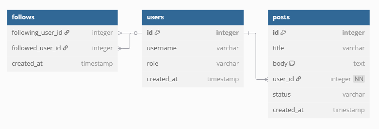

# mini-twitter
You are tasked with implementing a scalable REST API for a simple social media platform ("Mini-Twitter")

[TC.1] API Development:

        Use Python 3 and a Python web framework of your choice (Django REST Framework preferred).

        Implement the API following RESTful design principles.

🔐 [TC.2] Authentication:

        Use JWT (JSON Web Tokens) for user authentication and session management.

💽 [TC.3.1] Database:

        Use a relational database (preferably PostgreSQL).

        Ensure the database design follows best practices, with attention to normalization and performance optimization.

📄 [TC.4.] Pagination

        Implement pagination for the posts list

📂 [TC.8] Git

        Your project must be stored in a public git repository

        Failing this criteria will eliminate you immediately

🔋 [TC.3.2] Caching & Scalability:

        Implement caching (e.g., using Redis) for the user feed or other high-read endpoints to ensure scalability.

        bonus 1.: followers count in the user's profile

        bonus 2.: like count for each post

🔁 Asynchronous Tasks:

        Use Celery or other task queues to handle tasks asynchronously (e.g., sending email notifications when a user follows another user).

🔎 Search Feature:

        Add a search functionality to allow users to find posts by keyword or hashtags

🚀 CI/CD:

        Set up basic CI/CD to run automated tests (using tools like GitLab CI, GitHub Actions, or Jenkins).

se eu conseguir implementar tudo eu penso nos testes

ENDPOINTS

👨🏼‍🏫 USE CASES
CASE 1: User Registration

    Users should be able to sign up via the API by providing an email, username, and password.

    Use JWT to handle authentication for login and session management.

CASE 2: Post Creation

    Authenticated users can create a post with text and one image as content

    Posts can be liked by other users.

CASE 3: Follow/Unfollow User

    Users should be able to follow or unfollow others.

    The feed should only show posts from users the authenticated user follows.

CASE 4: Viewing Feed

    The user can view a paginated list of posts from the users they follow.

    Posts should be ordered by creation time, from most recent to oldest.

## Database Modeling

